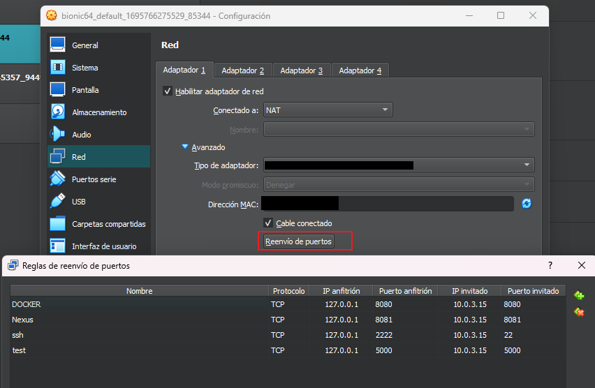

Maquina Virtual: 

1. Tiene que tener estos puertos abiertos
2. Para obtener el "IP invitado", ingresar a la maquina y correr:
            ifconfig

Buscar la ip de la maquina y tomarla para la configuracion

Seguir los pasos del script
luego

docker exec -ti [ID DE NEXUS] bash
bash > cd / 
bash > cd nexus-data/
bash > cat admin.password
#CON ESO SE INGRESA A NEXUS
